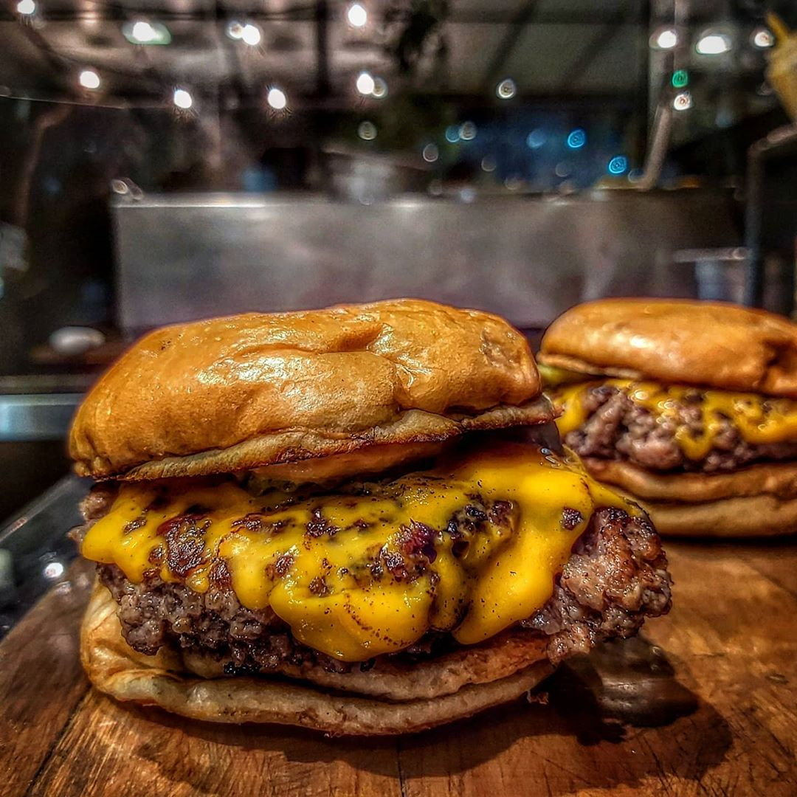

### 
BeefBurger

---

Projeto BeefBurger foi um dos meus primeiros projetos, foi desenvolvido com o único intuito de aprendizagem. Agora depois de muito tempo resolvi resgata-lo e atualizar.
 

Confesso que por inúmeras vezes tive vontade de excluir tudo e iniciar do zero , mais me contive pelo simples fato de ver a diferença enorme dos código anteriores de poder notar minha evolução. 

 

### Prática
---
Programação é um universo infinito, por isso ter foco é o primeiro passo.

 

### Tecnologias
---
* [React](https://expo.io/)
* [Styled Components](https://reactnative.dev/docs/stylesheet)
* [Axios](https://github.com/axios/axios)
* [Context](https://pt-br.reactjs.org/docs/context.html)

## Como contribuir
---

- Fork esse repositório;
- Crie uma branch com a sua feature: `git checkout -b my-feature`
- Commit suas mudanças: `git commit -m 'feat: My new feature'`
- Push a sua branch: `git push origin my-feature`

 

Desenvolvido com ❤️ por Indiamara Tibes Siqueira

